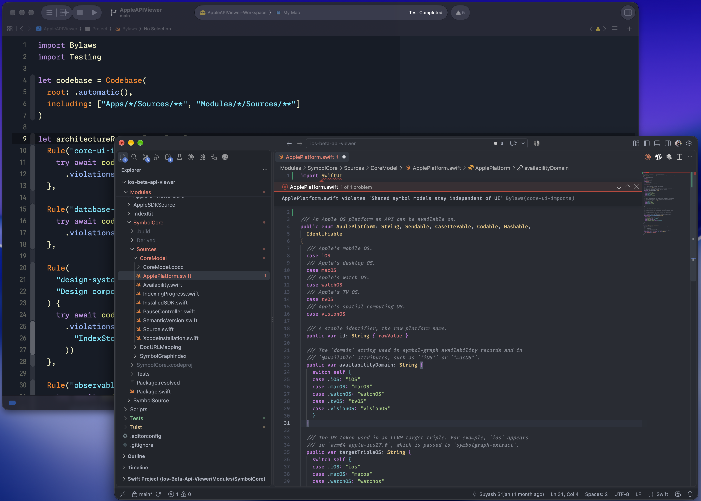

# Bylaws

Bylaws is an architectural linter for Swift, built for developers and coding agents.

[![Swift versions][Swift versions badge]][Swift Package Index]
[![Platforms][Platforms badge]][Swift Package Index]
[![CI][CI badge]][CI]



Read the [documentation] for guides and the API reference.

## Contents

- [Why Bylaws?](#why-bylaws)
- [What a rule can check](#what-a-rule-can-check)
- [Try Bylaws](#try-bylaws)
- [Practical rules](#practical-rules)
- [Get started](#get-started)
- [Run checks during development](#run-checks-during-development)
- [How it compares](#how-it-compares)
- [Benchmarks](#benchmarks)
- [Documentation](#documentation)

## Why Bylaws?

Every project has rules that the compiler cannot enforce. Some might concern
individual declarations or API use, such as naming conventions, required
protocols or which parts of the codebase can call an API. Others describe the
wider project through its folder layout or the dependencies allowed between
different parts of the codebase.

AI coding agents can help a team move faster, but the changes they produce can
also break project rules and be difficult to review line by line. Skill files
and `AGENTS.md` can provide useful context, but they cannot ensure that every
instruction is applied consistently.

With Bylaws, you can write your project rules using familiar Swift APIs and run
them through Swift Testing or the CLI. If a change breaks a rule, Bylaws reports
the relevant file and line so both developers and coding agents know what to
fix.

## What a rule can check

A rule can inspect declarations, function calls and other Swift syntax. It can
check where files and types belong, compare a `Package.swift` manifest with the
imports in its source, find dependency cycles or restrict references between
files, folders or modules.

Most rules only need access to the source code and project files, so the CLI can
run them without a build and Swift Testing compiles the test target as part of
the usual test run. If a rule needs compiler resolved references then it can
read the compiler index from the latest build.

## Try Bylaws

Create `Bylaws.swift` with a rule that keeps console output inside the logging
layer:

```swift
import Bylaws
import Testing

let app = Codebase(root: .automatic(), including: ["Sources/**"])

let projectRules: [Rule] = [
  Rule(
    "central-logging",
    "Console output goes through the logging layer"
  ) {
    try await app.calls
      .outside("Sources/Logging")
      .violations(
        matching: .references("print", "debugPrint", "NSLog")
      )
  },
]
```

Save the file at the project root to run it with the CLI, or place it in a test
target to run it with Swift Testing.

### Run the example with the CLI

Install `bylaws`, then run the rule from the project root:

```sh
brew install theblixguy/tap/bylaws
bylaws lint
```

If `Sources/App.swift` calls `print`, the command exits with status 1 and points
to the call and the rule that reported it:

```text
/path/to/App/Sources/App.swift:2:3: error: print violates 'Console output goes through the logging layer' [central-logging]
/path/to/App/Bylaws.swift:7:3: note: rule 'central-logging' is declared here
Checked 1 rule: 1 violation.
```

### Run the example with Swift Testing

Add the `Bylaws` product to a test target, then add this test. If you start with
Swift Testing, you can define `projectRules` in the same file and move them into
a shared `Bylaws.swift` later. In either location, `.automatic()` finds the
package root so `Sources/**` will select the same files.

```swift
import Bylaws
import Testing

@Test("Code follows project rules", arguments: projectRules)
func projectRule(_ rule: Rule) async throws {
  try await rule.report()
}
```

The rule runs with the rest of your tests:

```sh
swift test
```

If the rule finds a violation, the test fails and the output points to the
affected code. The [getting started guide] includes the package dependency and
explains how to share one rules file between Swift Testing and the CLI.

If a new rule reports existing problems, you can keep it advisory while you
review the results or record a baseline so new violations fail the check. The
[adopting rules guide] covers both options.

## Practical rules

These examples show some of the checks you can write. The [rule cookbook] and
[other guides](#documentation) cover more of the API, so you can choose the
rules that fit your project.

### Control dependencies between layers

Suppose `Checkout` reads stored data through an API declared in `Domain`, while
`Persistence` provides the implementation. `Checkout` and `Persistence` may
import `Domain`, but `Checkout` must use the `Domain` API to stay independent of
the storage implementation.

If `Persistence` is a target dependency of `Checkout`, the import compiles even
though it breaks this design. The following rule enforces the intended boundary:

```swift
let appLayers = Layering(
  Layer("Domain", files: ["Sources/Domain/**"]),
  Layer(
    "Persistence",
    files: ["Sources/Persistence/**"],
    mayImport: ["Domain"]
  ),
  Layer("Checkout", files: ["Sources/Checkout/**"], mayImport: ["Domain"])
)

Rule("feature-boundaries", "Modules follow their declared dependencies") {
  try await app.checkLayering(appLayers)
}
```

The restrictions apply between the layers listed here. Imports of other
modules, such as `Foundation`, remain permitted. If `Checkout` imports
`Persistence`, `bylaws lint` will point to the import that crosses the boundary:

```text
/path/to/App/Sources/Checkout/CheckoutViewModel.swift:2:8: error: import Persistence violates 'Modules follow their declared dependencies' [feature-boundaries]
Checked 1 rule: 1 violation.
```

If these folders live inside one app target, the [compiler index] can enforce
the same boundary without module imports.

### Prefer scoped locking

If your project uses `NSLock.withLock`, you can report direct `lock()` and
`unlock()` calls without writing a SwiftSyntax visitor:

```swift
let manualLocking = Matcher<SourceNode>("call lock or unlock directly") {
  $0.call?.references("lock.lock") == true
    || $0.call?.references("lock.unlock") == true
}

Rule("scoped-locking", "Locks use withLock") {
  try await app.syntaxNodes(of: .functionCall)
    .violations(matching: manualLocking)
}
```

A rule can use the node's parent or ancestors to distinguish the same call in
different contexts.

### Require a shared base class for screen models

If your app keeps shared screen behaviour in `BaseScreenModel`, a class that
conforms to `ScreenModel` should inherit that behaviour. You can check this even
when the conformance comes from an extension or an intermediate class:

```swift
Rule("screen-model-base", "Screen models inherit BaseScreenModel") {
  try await app.classes
    .where(.conforms(to: "ScreenModel") && !.named("BaseScreenModel"))
    .violations(of: .inherits(from: "BaseScreenModel"))
}
```

### Use domain types for identifiers

Distinct `CustomerID` and `OrderID` types let the compiler catch an order ID
passed where a customer ID is required. This rule reports properties under
`Sources/Domain` whose names end in `ID` and whose type annotations specify
`String`, `Int` or `UUID`:

```swift
Rule("domain-identifiers", "Identifiers use domain types") {
  try await app.properties
    .under("Sources/Domain")
    .suffixed("ID")
    .violations(matching: .hasType("String", "Int", "UUID"))
}
```

### Give stored enum cases explicit values

Renaming a string-backed enum case also changes its implicit raw value. If your
app saves those values, you can require explicit raw values so a rename can keep
the stored format unchanged. This rule checks `Codable` enums under
`Sources/Storage`:

```swift
Rule("stored-enum-values", "Stored enum cases declare explicit values") {
  try await app.enums
    .under("Sources/Storage")
    .where(.declaresInheritance("String") && .conforms(to: "Codable"))
    .violations(of: Matcher<Enum>("declare explicit raw values") { anEnum in
      anEnum.cases.allSatisfy { $0.rawValue != nil }
    })
}
```

### Keep preferences access in one type

You can keep functions that call `UserDefaults` inside `PreferencesStore`, where
the app manages its preference keys and default values:

```swift
Rule("preferences-access", "Functions that call UserDefaults belong to PreferencesStore") {
  try await app.functions
    .where(.calls("UserDefaults"))
    .violations(of: Matcher<Function>("belong to PreferencesStore") { function in
      function.enclosingTypeName == "PreferencesStore"
    })
}
```

The [declaration guide] shows separate queries for calls in property
initialisers and accessors.

### Keep each feature's files in the right folders

You can require each feature to contain exactly `Models`, `ViewModels` and
`Views` as child folders, with a violation for any missing or extra folder:

```swift
Rule("feature-folders", "Features contain Models, ViewModels and Views") {
  try await app.checkFolderLayout(
    matching: "Sources/App/*",
    containing: ["Models", "ViewModels", "Views"]
  )
}
```

A separate rule checks where the types belong:

```swift
Rule("view-model-folders", "View models belong in ViewModels") {
  try await app.types.under("Sources/App").suffixed("ViewModel")
    .violations(outsidePaths: "Sources/App/*/ViewModels/**")
}
```

The [folder guide] includes checks for views and models with examples for a
module that shares folders across features.

You can also [set permitted references and check cycles between file groups] or
[require corresponding types], such as a view model for each feature view and a
test type for each repository.

### Keep package dependencies consistent with imports

You can check that dependencies between targets in the same `Package.swift`
match their imports. This rule reports a missing dependency when a target
imports a module it hasn't declared or an unused dependency when the target no
longer imports it.

Define a codebase beside `app` that includes both application and test sources:

```swift
let packageCodebase = Codebase(
  root: .automatic(),
  including: ["Sources/**", "Tests/**"]
)
```

If your targets use other directories, add those paths to `including` so their
imports are checked too. Then add this rule to `projectRules`:

```swift
Rule("package-dependencies", "Package.swift matches source imports") {
  try await packageCodebase.checkPackageDependencies()
}
```

Bylaws reports warnings for targets it cannot check.

The [rule cookbook] also covers protocol requirements, SwiftUI state, lifecycle
calls and compiler-resolved references.

## Get started

### Requirements

- Swift: 6.2 or later, included with Xcode 26 or later
- Libraries: iOS 13 or later, macOS 14 or later or Linux
- CLI and language server: macOS 14 or later or Linux

### Choose how to run rules

| Workflow        | Use it when                                                          | Result                                            |
| --------------- | -------------------------------------------------------------------- | ------------------------------------------------- |
| [`bylaws` CLI]  | The rules must run before a build or from CI                         | Violations in Xcode, GitHub, JSON or SARIF format |
| [Swift Testing] | The rules belong with the test suite or need the full Swift language | Test cases with source diagnostics in Xcode       |

> [!NOTE]
>
> You can run the same rules from the CLI and a test target if they use the
> CLI's supported Swift subset. The [getting started guide] explains how to
> share them, while the [SwiftPM plugins], [Bazel target] and
> [editor integrations] sections cover the requirements for those workflows.

### Run rules from the command line

The [CLI setup guide] covers installation on macOS and Linux. Put
`Bylaws.swift` at the project root, then run:

```sh
bylaws lint
```

If you want to start with warning-only rules instead, run `bylaws init` in a
project that has no `Bylaws.swift` file. You can also record a baseline to
permit existing violations while rejecting new ones.

In CI, you can pass the complete list of files changed since the previous run
with `--changed-path`. Bylaws reruns the rules affected by those files and uses
cached results for the rest. [Running rules from the CLI] covers this workflow,
discovery, shared rule packages, baselines and CI.

### Run rules with Swift Testing

Add the package and the `Bylaws` product to a test target:

```swift
dependencies: [
  .package(
    url: "https://github.com/theblixguy/swift-bylaws.git",
    from: "0.6.0",
    traits: []
  )
],
targets: [
  .testTarget(
    name: "AppTests",
    dependencies: [
      .product(name: "Bylaws", package: "swift-bylaws")
    ]
  )
]
```

On macOS, Bylaws uses a prebuilt SwiftSyntax library when one matches your
compiler, so SwiftPM can skip compiling SwiftSyntax during the first test build.
SwiftPM uses the SwiftSyntax source package on Linux and for other compiler
versions.

Set `traits: []` if you only use Bylaws in tests or omit it if you also use the
plugins, CLI or language server.

Put the rules file from [Try Bylaws](#try-bylaws) in
`Tests/AppTests/Bylaws.swift` and put its parameterised test in
`Tests/AppTests/ArchitectureTests.swift`.

Run the rules with the rest of the tests:

```sh
swift test
```

Rule violations fail the test and report the affected file and line. If you mark
a rule as `.advisory`, its violations appear as warnings instead.

To run the same rules from the CLI, pass the rules file to `bylaws lint`:

```sh
bylaws lint --rules Tests/AppTests/Bylaws.swift
```

You can also create one test case per matching declaration, as shown in the
[declaration guide]. To keep a shared rules file at the project root for plugins
and editors, use [test discovery] instead of compiling the rules as part of the
test target. Use discovery for files created by `bylaws init` too, as those
files use CLI syntax that cannot compile unchanged in a test target.

## Run checks during development

### Use the SwiftPM plugins

You can use either plugin without installing `bylaws` separately, and your rules
file can import shared rules from other package dependencies.
Use the plugins for those imports, as the standalone CLI does not resolve the
package dependencies.

| Plugin                                 | Use it when                                                                                          | How it runs                                                 |
| -------------------------------------- | ---------------------------------------------------------------------------------------------------- | ----------------------------------------------------------- |
| Command plugin (`BylawsPlugin`)        | You want a separate local or CI check, need to record a baseline or run rules that use compiler data | You run `swift package bylaws` when needed                  |
| Build plugin (`BylawsBuildToolPlugin`) | Rule violations should stop a SwiftPM build                                                          | SwiftPM runs the check before compiling the attached target |

You can use both plugins to check rules during builds and record baselines
separately. For projects without a Swift package, use the standalone
`bylaws lint` command with local rules files.

#### Run the command plugin

Add Bylaws to your package dependencies and put `Bylaws.swift` at the package
root. The command plugin is available without attaching it to a target:

```sh
swift package --allow-writing-to-package-directory bylaws
```

The permission flag lets the plugin write a baseline when you request one. You
can pass lint options after `bylaws`, such as `--only feature-boundaries`. If
any of your rules use the compiler index, build the project before you run the
plugin.

#### Run the build plugin

Add Bylaws to your package dependencies, put `Bylaws.swift` at the package root
and attach `BylawsBuildToolPlugin` to one target that your build includes:

```swift
.target(
  name: "App",
  plugins: [
    .plugin(name: "BylawsBuildToolPlugin", package: "swift-bylaws"),
  ]
)
```

Build with this flag so SwiftPM runs the checks on each build:

```sh
swift build --disable-build-manifest-caching
```

> [!IMPORTANT]
>
> The flag is required because SwiftPM can otherwise reuse a build plan and skip
> checks after a source edit.

The plugin checks rules against any recorded baselines and fails the build on
enforced violations. Attaching it to several targets repeats the package-wide
check, so attach it once per package. Use the command plugin to record
baselines, see advisory warnings or run rules that need compiler data.

The build plugin works with SwiftPM command-line builds but cannot be attached
directly to an Xcode project target. [Build-tool plugin setup] covers the
supported builds and rule restrictions.

### Run checks with Bazel

You can run Bylaws as a separate local or CI check with Bazel 7.1 or later on
macOS and Linux.

Add the dependency from the Bazel Central Registry to `MODULE.bazel`:

```starlark
bazel_dep(name = "swift-bylaws", version = "0.6.0")
```

Put `Bylaws.swift` at the workspace root, then run:

```sh
bazel run @swift-bylaws//:bylaws -- lint
```

To check rules during `bazel build`, add a [Bazel lint target]. It checks the
declared source files, including generated files, and produces a JSON report.
Bazel caches parsed source groups separately, so a rule change can reuse all of
them and a source change only reparses its group. You can also [check Bazel
target dependencies] using an exported graph, without a `Package.swift`.

### Show violations in an editor

Install the Bylaws integration for your editor and follow its setup guide: [VS
Code or Cursor], [Zed], [Neovim] or [Emacs]. The guides cover installation of
the `bylaws-lsp` executable as well as the editor settings.

Open a project with a `Bylaws.swift` file to see violations as you edit Swift
code, including changes you haven't saved. The editor uses the same rules and
baseline as the CLI.

Compiler-index rules check the code from a build rather than unsaved edits.
After saving and rebuilding your project, restart the language server to
refresh those results.

## How it compares

If you use SwiftLint for style and correctness checks, you can add Bylaws to
enforce your project's architecture rules.

### Run and integrate rules

| Feature                    | Bylaws                                                                               | [Harmonize]                                                          | [SwiftLint]                                                                           |
| -------------------------- | ------------------------------------------------------------------------------------ | -------------------------------------------------------------------- | ------------------------------------------------------------------------------------- |
| Run rules                  | Swift Testing or CLI                                                                 | Swift Testing, XCTest or Quick                                       | CLI                                                                                   |
| SwiftPM build              | Prebuilt SwiftSyntax for matching macOS compilers, with a source fallback            | SwiftSyntax builds from source                                       | Plugins download a prebuilt tool                                                      |
| SwiftPM command plugin     | `swift package bylaws`                                                               | None                                                                 | `swift package plugin swiftlint`                                                      |
| Build-tool plugin          | SwiftPM (build flag required)                                                        | None                                                                 | SwiftPM and Xcode                                                                     |
| Bazel integration          | `bazel run` and a [cacheable lint target][Bazel lint target] for source checks       | No bundled integration                                               | [`bazel run`](https://github.com/realm/SwiftLint#bazel)                               |
| Editor integration         | Xcode test diagnostics and live LSP checks in VS Code, Cursor, Zed, Neovim and Emacs | Test diagnostics in Xcode                                            | Xcode build diagnostics and community editor extensions such as SwiftLint for VS Code |
| Share rules                | Swift packages for tests and both plugins                                            | Swift helpers in test dependencies                                   | Shared YAML or a custom binary for Swift rules                                        |
| Rules per folder or module | Automatic folder discovery, exclusions and overrides with a reason                   | Query filters and file exclusions                                    | Nested configuration files                                                            |
| Accept existing violations | Recorded baseline, checked for entries that no longer apply                          | Hand-written list of names, checked for entries that no longer apply | Recorded JSON baseline                                                                |
| Warning-only rules         | Advisory rules in tests and the CLI                                                  | Severity metadata with test failures by default                      | Configurable warning and error levels                                                 |
| Changed-file checks        | Pass changed paths to skip unaffected rules and reuse cached results                 | None                                                                 | Pass changed files or use the per-file cache                                          |
| Report results             | Test failures, Xcode, GitHub, JSON and SARIF with rule locations                     | Test failures and JSON                                               | Xcode, GitHub, JSON, SARIF and other formats                                          |
| Automatic fixes            | None                                                                                 | None                                                                 | `--fix` for supported rules                                                           |

### What rules can check

| Feature                                  | Bylaws                                                                             | Harmonize                                                | SwiftLint                                            |
| ---------------------------------------- | ---------------------------------------------------------------------------------- | -------------------------------------------------------- | ---------------------------------------------------- |
| Custom rules                             | Swift queries and matchers for source and syntax nodes                             | Swift queries and assertions                             | Regex in YAML or Swift rules in a custom build       |
| Declarations, calls and type annotations | Source model and SwiftSyntax access                                                | Source model and SwiftSyntax access                      | SwiftSyntax in Swift custom rules                    |
| Inheritance and conformance              | Transitive source queries, including aliases and extensions                        | Direct and transitive source queries                     | Swift custom rules                                   |
| Macro uses and call argument labels      | Query APIs                                                                         | SwiftSyntax access where query APIs do not cover a check | Swift custom rules                                   |
| Allowed imports between layers           | Declare layers and allowed imports                                                 | Write checks over imports                                | Swift custom rules                                   |
| Layer boundaries within a module         | Folder-based layers with compiler-resolved references                              | None                                                     | None                                                 |
| SwiftPM manifest                         | Query targets, products, platforms, traits and build settings                      | None                                                     | None                                                 |
| SwiftPM target dependencies              | Find unused and undeclared target dependencies                                     | None                                                     | Import rules without a local target-dependency check |
| Bazel target dependencies                | Direct/transitive dependencies and build settings from configured `cquery` exports | No built-in graph queries                                | No built-in graph queries                            |
| Import graph and dependency stability    | Graph queries and stability checks                                                 | None                                                     | None                                                 |
| Compiler data                            | Optional index for resolved references and conformances                            | Source syntax model                                      | `analyze` with a clean build log                     |

## Benchmarks

These benchmarks compare how long Bylaws and SwiftLint take to check ten
corresponding source properties in the same files across five open-source Swift
projects. The times below are in seconds and exclude compilation.

<table>
<thead>
<tr>
<th rowspan="2">Project</th>
<th rowspan="2" align="right">Swift files</th>
<th rowspan="2" align="right">Lines</th>
<th colspan="3" align="center">Bylaws</th>
<th colspan="2" align="center">SwiftLint</th>
</tr>
<tr>
<th align="right"><code>bylaws lint</code> (s)</th>
<th align="right"><code>swift test</code> uncached (s)</th>
<th align="right"><code>swift test</code> cached (s)</th>
<th align="right"><code>--no-cache</code> (s)</th>
<th align="right">Cached (s)</th>
</tr>
</thead>
<tbody>
<tr>
<td>RxSwift</td>
<td align="right">264</td>
<td align="right">30,294</td>
<td align="right">0.07</td>
<td align="right">1.07</td>
<td align="right">0.91</td>
<td align="right">0.14</td>
<td align="right">0.10</td>
</tr>
<tr>
<td>Realm</td>
<td align="right">130</td>
<td align="right">76,507</td>
<td align="right">0.19</td>
<td align="right">1.50</td>
<td align="right">1.13</td>
<td align="right">0.34</td>
<td align="right">0.10</td>
</tr>
<tr>
<td>Kickstarter</td>
<td align="right">1,631</td>
<td align="right">261,712</td>
<td align="right">0.33</td>
<td align="right">2.40</td>
<td align="right">1.43</td>
<td align="right">0.68</td>
<td align="right">0.33</td>
</tr>
<tr>
<td>WordPress</td>
<td align="right">3,260</td>
<td align="right">428,267</td>
<td align="right">0.50</td>
<td align="right">3.58</td>
<td align="right">1.71</td>
<td align="right">0.99</td>
<td align="right">0.40</td>
</tr>
<tr>
<td>Firefox</td>
<td align="right">3,013</td>
<td align="right">407,427</td>
<td align="right">0.53</td>
<td align="right">3.72</td>
<td align="right">1.82</td>
<td align="right">1.45</td>
<td align="right">0.91</td>
</tr>
</tbody>
</table>

## Documentation

- [Getting started]
- [Rule cookbook]
- [Combine checks and match declaration members]
- [Running rules from the CLI]
- [Inspect a rule's selections]
- [Running rules during builds]
- [What Bylaws reads]
- [Editor setup]
- [Frequently asked questions]

Use [GitHub Issues] for bugs, questions and proposed rules.

## Licence

Bylaws is available under the MIT licence. See [LICENSE].

[documentation]: https://theblixguy.github.io/swift-bylaws/documentation/bylaws/
[compiler index]:
  https://theblixguy.github.io/swift-bylaws/documentation/bylaws/architecturerules#Layers-inside-one-module
[declaration guide]:
  https://theblixguy.github.io/swift-bylaws/documentation/bylaws/declarationrules
[folder guide]:
  https://theblixguy.github.io/swift-bylaws/documentation/bylaws/folderrules
[set permitted references and check cycles between file groups]:
  https://theblixguy.github.io/swift-bylaws/documentation/bylaws/dependencyrules
[require corresponding types]:
  https://theblixguy.github.io/swift-bylaws/documentation/bylaws/correspondingtypes
[rule cookbook]:
  https://theblixguy.github.io/swift-bylaws/documentation/bylaws/rulecookbook
[What Bylaws reads]:
  https://theblixguy.github.io/swift-bylaws/documentation/bylaws/whatbylawsreads
[`bylaws` CLI]: #run-rules-from-the-command-line
[Swift Testing]: #run-rules-with-swift-testing
[getting started guide]:
  https://theblixguy.github.io/swift-bylaws/documentation/bylaws/gettingstarted
[adopting rules guide]:
  https://theblixguy.github.io/swift-bylaws/documentation/bylaws/ruleadoption
[SwiftPM plugins]: #use-the-swiftpm-plugins
[Bazel target]: #run-checks-with-bazel
[Bazel lint target]:
  https://theblixguy.github.io/swift-bylaws/documentation/bylaws/runningruleswithbazel
[check Bazel target dependencies]:
  https://theblixguy.github.io/swift-bylaws/documentation/bylaws/bazeldependencies
[editor integrations]: #show-violations-in-an-editor
[CLI setup guide]:
  https://theblixguy.github.io/swift-bylaws/documentation/bylaws/runningrulesfromthecli
[Running rules from the CLI]:
  https://theblixguy.github.io/swift-bylaws/documentation/bylaws/runningrulesfromthecli
[test discovery]:
  https://theblixguy.github.io/swift-bylaws/documentation/bylaws/runningrulesfromthecli#Run-a-rules-file-as-tests
[Build-tool plugin setup]:
  https://theblixguy.github.io/swift-bylaws/documentation/bylaws/runningrulesduringbuilds
[VS Code or Cursor]: Editors/VSCode/README.md
[Zed]: Editors/Zed/README.md
[Neovim]: Editors/Neovim/README.md
[Emacs]: Editors/Emacs/README.md
[Harmonize]: https://github.com/perrystreetsoftware/Harmonize
[SwiftLint]: https://github.com/realm/SwiftLint
[Getting started]:
  https://theblixguy.github.io/swift-bylaws/documentation/bylaws/gettingstarted
[Combine checks and match declaration members]:
  https://theblixguy.github.io/swift-bylaws/documentation/bylaws/combiningchecks
[Inspect a rule's selections]:
  https://theblixguy.github.io/swift-bylaws/documentation/bylaws/inspectingrules
[Running rules during builds]:
  https://theblixguy.github.io/swift-bylaws/documentation/bylaws/runningrulesduringbuilds
[Editor setup]: Editors/README.md
[Frequently asked questions]: FAQ.md
[GitHub Issues]: https://github.com/theblixguy/swift-bylaws/issues
[LICENSE]: LICENSE
[Swift Package Index]: https://swiftpackageindex.com/theblixguy/swift-bylaws
[Swift versions badge]:
  https://img.shields.io/endpoint?url=https://swiftpackageindex.com/api/packages/theblixguy/swift-bylaws/badge?type=swift-versions
[Platforms badge]:
  https://img.shields.io/endpoint?url=https://swiftpackageindex.com/api/packages/theblixguy/swift-bylaws/badge?type=platforms
[CI]: https://github.com/theblixguy/swift-bylaws/actions/workflows/ci.yml
[CI badge]: https://github.com/theblixguy/swift-bylaws/actions/workflows/ci.yml/badge.svg
